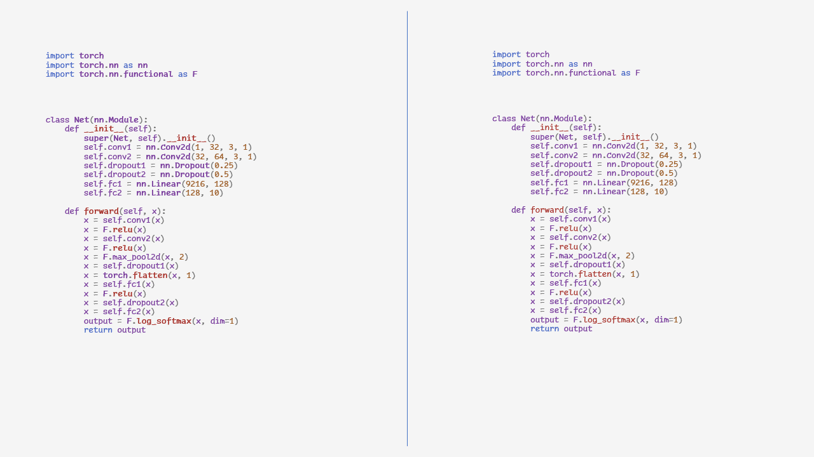

# Jackdaw ML

Jackdaw is a framework designed to help Data Scientists save, load, and deploy Machine Learning models in a 
simple and robust way.

Unlike other frameworks, sharing a model only requires two short lines of code.

1. `@find_artefacts`
    
    Scan model code, finding model artefacts and variables. Jackdaw supports PyTorch, Tensorflow, XGBoost, and LightGBM
    out of the box, but is trivial for users to expand to other frameworks.


2. `jackdaw_ml.saves`
    
    Model artefacts are saved to either local or remote storage, and the user is provided with a Model ID. 
    Users can store the ID for use in deployment, or search for the model by its name, metrics, Git branch, etc. 

A Model can be as simple as a stored number, or as complex as a combination of frameworks. Regardless of complexity, 
Jackdaw aims to make it simple to share your models with other applications, other colleagues, or other companies.

Documentation is baked into the repository, and is available [here](docs). 




## Setup - Working Locally
Jackdaw is available on [PyPi](https://pypi.org/project/jackdaw-ml/) and can be installed via pip;

```bash
>>> pip install jackdaw_ml
```

### Alpha - Limited Windows & Mac Support
While Jackdaw is in Alpha, one of the libraries it relies upon - artefactlink - only supports Windows and Mac OS/X for Python 3.10. Linux support is available for 3.8, 3.9, and 3.10.

## Setup - Sharing Models across Environments
To share items across multiple computers, you'll eventually need an account with ShareableAI. 

For now, you just need your API Token. If you don't have a token, reach out to `lissa@shareablei.com` and they'll ping you one.

## Roadmap - Future Features
[View our Public Roadmap here](https://github.com/orgs/shareableai/projects/1/views/1)


## Getting Started

### Example by Framework 
* [SKLearn](examples/frameworks/test_sklearn.py)
* [LightGBM](examples/frameworks/test_lightgbm.py)
* [XGBoost](examples/frameworks/test_xgboost.py)
* [PyTorch](examples/frameworks/test_pytorch.py)
* [Tensorflow](examples/frameworks/test_tensorflow.py)
* [DARTs](examples/frameworks/test_darts.py)

### Example

The core magic of Jackdaw is within the `@artefacts` and `@find_artefacts` decorators.

`@artefacts` allows you to list what should be saved on a Model. `@find_artefacts` will detect what should be saved based
on a whole host of common frameworks. Combining the two is a powerful way of ensuring complex models can be saved easily.


```python
from jackdaw_ml.artefact_decorator import find_artefacts
from jackdaw_ml.trace import trace_artefacts
from jackdaw_ml import saves

import lightgbm as lgb
import numpy as np

@find_artefacts()
class BasicLGBWrapper:
    model: lgb.Booster

    
# The LightGBM model isn't defined yet, but we can discover it via annotations.
#   LightGBM is Pickle-safe, so it's serialised via the PickleSerialiser by default.
# >>> trace_artefacts(BasicLGBWrapper())
# <class '__main__.BasicLGBWrapper'>{
#         (model) [<class 'jackdaw_ml.serializers.pickle.PickleSerializer'>]
# }


def example_data() -> lgb.Dataset:
    data = np.random.rand(500, 10)  # 500 entities, each contains 10 features
    label = np.random.randint(2, size=500)  # binary target
    return lgb.Dataset(data, label=label)

# Create a new Model
model = BasicLGBWrapper()
# Modify the model
model.model = lgb.train({}, example_data())

# Save the model
model_id = saves(model)
```


## Saving Remotely
Saving and loading items from ShareableAI servers, rather than locally, can be achieved by providing an API key alongside the call to 
`artefacts`. If you'd like to test this, please follow the setup for Sharing Models Remotely.

```python

from jackdaw_ml.artefact_decorator import artefacts
from jackdaw_ml.serializers.pickle import PickleSerializer
from jackdaw_ml.artefact_endpoint import ArtefactEndpoint

@artefacts({PickleSerializer: ["x"]}, endpoint=ArtefactEndpoint.remote('MyAPIKey'))
class MyModel:
    def __init__(self):
        self.x = 3
```

We'll be expanding this to allow for sharing items between other users *very* soon, so keep an eye on [Corvus](https://github.com/shareableai/jackdaw/issues/2) to know more. 
